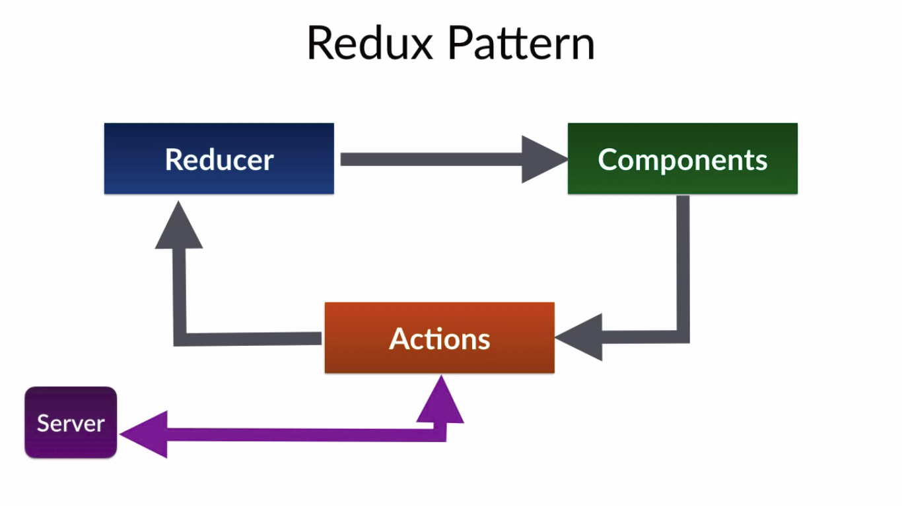

## react-myntra-admin

- Created a react application to manage admin data.

## Features

- Home screen
  - We can navigate to six sub pages of admin panel.
- Products screen
  - We can add product detail like: Name, Detail, Image etc... and save it.
- Users screen
  - We can see all the registed users list.
- MainCategory screen
  - We can add mainCategory of any product.
- Categories screen
  - We can add sub category of any main category.
- Brand screen
  - We can add brand of any product.
- Offers screen
  - We can add offers and save it.

## Tech components

- **React**
  - React.js is one of the most popular front-end JavaScript and TypeScript libraries for building Web applications. It is actively maintained by Meta and a community of skilled developers and companies.
- **TypeScript**
  - TypeScript Code is converted into Plain JavaScript Code: TypeScript code can’t be natively interpreted by browsers. So if the code was written in TypeScript, it gets compiled and converted into JavaScript. This process is known as Trans-piled. With the help of JavaScript code, browsers are able to read the code and display it.
  - JavaScript is TypeScript: Whatever code is written in JavaScript can be converted to TypeScript by changing the extension from .js to .ts.
  - Use TypeScript anywhere: TypeScript can be compiled to run on any browser, device, or operating system. TypeScript is not specific to any single environment.
  - TypeScript supports JS libraries: With TypeScript, developers can use already existing JavaScript code, incorporate popular JavaScript libraries, or call the TS Code from native JavaScript code.
- **Redux**
     

    
  

  - Increases the Predictability of a State. In the Redux library, a state is invariably predictable.
  - It is Highly Maintainable.
  - It Prevents Re-renders.
  - Redux Optimizes Performance.
  - Makes Debugging Easier.
  - Useful in Server-Side Rendering.
  - Provides Ease of Testing.

- **LifeCycle Component**
  - Hooks
  - Functional Components

- **Unit Testing**
  - Junit Framework
  - Offers a CLI tool to control your tests easily
  - Comes with an interactive mode that automatically runs all affected tests for the code changes you’ve made in your last commit
  - Provides syntax to test a single test or skip tests with .only and .skip. This feature is useful when debugging individual
    tests

## Available Scripts

In the project directory, you can run:

### `npm start`

Runs the app in the development mode.\
Open [http://localhost:3000](http://localhost:3000) to view it in the browser.

The page will reload if you make edits.\
You will also see any lint errors in the console.

### `npm test`

Launches the test runner in the interactive watch mode.

### `npm run build`

Builds the app for production to the `build` folder.\
It correctly bundles React in production mode and optimizes the build for the best performance.

The build is minified and the filenames include the hashes.\
Your app is ready to be deployed!

